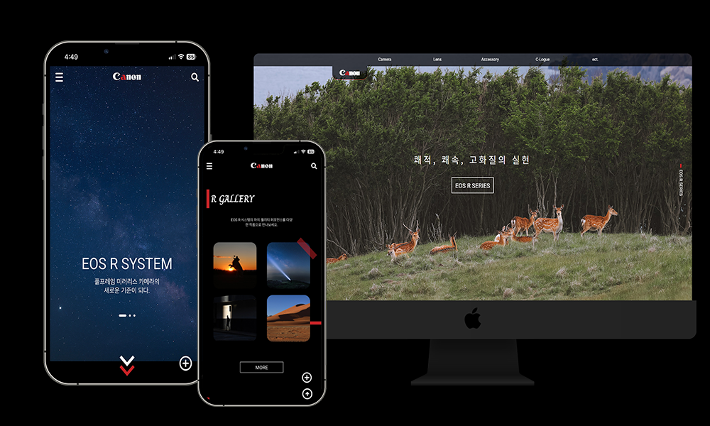

# 안녕하세요 신입 웹 프론트엔드 개발자 성해련 입니다.

<br>

### CANON 리뉴얼
### "카메라로 보는 세상"

<br>



<br>

- Demo : http://rien.dothome.co.kr/portfolio/

<br>

---

### 개발 목표
  - 기존 사무기기와 카메라 제품이 한 페이지에 모여 있어 제품 구분이 어려운 부분 개선을 위해 카메라 전용 페이지를 제작

  <br>

### 사용 기술
  - HTML
  - SASS
  - Javascript
  - Jquery
  - PHP

  <br>

### 라이브러리
  - slick
  - waypoint
  - aos
  - mousewheel
  - cookie

  <br>

## Point

### **PHP와 cookie.js를 활용한 자동로그인 구현**

<br>

로그인 페이지에서 체크박스의 체크 상태를 전달
```html
  <p class="remember">
    <label for="remember">자동 로그인</label><input type="checkbox" name="remember" id="remember" value="y">
  </p>
```
<br>
<br>

login.php에서 if문을 사용하여 체크 상태로 로그인 시 쿠키에 id값을 저장
```php
  if($remember == 'y') {
    setcookie("c_id",$id,(time()+86400),"/");
  }
```

<br>
<br>

다음 페이지 접속시 cookie 값이 있는지 확인 후 있는 경우 로그인 상태로 메인 페이지 연결
```php
    <?
  } else if($_COOKIE['c_id']) {

    $userid = $_COOKIE['c_id'];

    include "dbinit.php";

    mysqli_query($connect, 'set names utf8');
  
    $sql = "select * from member where id='$userid'";
    $result = mysqli_query($connect, $sql);
    $row = mysqli_fetch_array($result);
    
    $username = $row['name'];
    $_SESSION['username'] = $username
  ?>


```